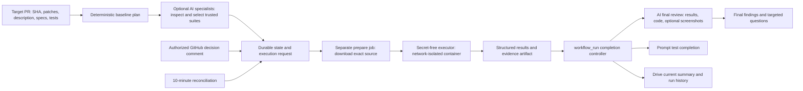

# Automated PR QA bot

A standalone QA bot with an optional **OpenRouter or local AI team**: browse models, assign specialists to test planning, code review, security, UI/UX, and failure triage, then run trusted test suites and report the evidence. A local dashboard manages models and shows findings, suggested fixes, candidate tests, and review costs.

The [autonomous QA runner](docs/autonomous-qa.md) adds bounded browser discovery, generated declarative regression journeys grounded in trusted assertions, independent replay, retained tests, semantic selector maintenance, and explicit visual baselines. Chromium, Firefox, and WebKit are selectable. The [Patchsentry portal](https://patchsentry.vercel.app) can queue exact-revision work for an explicitly enrolled outbound runner. Product source stays read-only; browser/native infrastructure and business expectations must still be supplied.

The [native adapter](docs/native-qa.md) runs explicit Android, iOS, and macOS journeys through an enrolled local Appium server on a disposable device or VM. It verifies a trusted build artifact against the requested revision before accepting evidence. Physical-device and native-driver verification require your provisioned environment.

The GitHub App controller runs tests in isolated GitHub Actions jobs, saves reports to Google Drive, and asks specific human questions through Slack. Its deterministic workflow remains usable without AI or a paid model service. Platform usage limits and hosting costs still apply.

The bot can comment, label, and report commit statuses on product PRs. It has no tool for editing product files, pushing fixes, or merging. Bot state, external browser suites, candidate tests, and reports stay in its separate workspace. See [testing a product without code changes](docs/product-qa.md).

QA completes when every required check passes and every mandatory question is resolved for the tested revision. There is no participation quota, reviewer coverage table, weekly missing-review report, or routine human sign-off. GitHub approvals alone do not complete QA. The MIT license is retained.

## Run locally

Requires Node.js **22.17 or later**. The demo and tests use built-in Node modules and require no credentials, dependency installation, or network access:

```sh
npm run demo
npm run demo:ai
npm test
```

The full test suite also uses Git, Python 3, and the standard `zip`/`unzip` utilities for revision and archive-safety checks. The demo itself needs only Node and npm.

The demo copies a synthetic shipping application into temporary directories and runs **real tests**. It demonstrates automatic completion, a deliberately broken shipping boundary with assertion evidence, a targeted owner question and recorded response, a Drive report preview, Slack notifications, and a new commit invalidating previous results and decisions. Every external operation is explicitly marked **MOCK**. Temporary state and evidence are removed afterward. The local fixture process is trusted demo code; untrusted PRs run only in containers.

The AI demo uses the real tool loop and OpenRouter adapter with explicitly **mocked model responses**. Its fixture tests really execute and catch a shipping defect; an AI summary cannot override that failure. It also exercises cited code/UI findings, proposed test source, budget accounting, and deduplicated reviews. No API key or network is used.

To browse the live model catalog and configure your team:

```sh
npm run dashboard
```

Open **http://127.0.0.1:8787**. Catalog browsing needs no key. Select models, enable AI, and save configuration. For a live review, set `OPENROUTER_API_KEY` in your terminal environment, then run:

```sh
npm run review -- --repo /path/to/product --base main --head HEAD
```

This command reviews committed Git revisions and saves a local report. Add `--web-suite examples/web-suite.json` to run a bot-owned browser suite against your disposable preview. Configure the suite for your product first. Without that option, the command does not launch tests. Add `--dry-run` to preview without model calls or saved state. See [AI setup and limits](docs/ai.md), [dashboard instructions](docs/dashboard.md), and [test execution](docs/execution.md).

For the live controller's GitHub App client dependencies:

```sh
npm ci --ignore-scripts
```

`package-lock.json` pins the dependency tree. No credentials or production activation are included.

## Architecture



The bot stays in its own repository. The target application needs a supported test suite or a runnable preview with bot-owned browser checks, and installation of the GitHub App; it needs no bot source, workflow, Slack secret, or Drive credential. New PR revisions and comments are discovered on the ten-minute reconciliation schedule. Test completion uses a **`workflow_run` event**, without waiting for that schedule. Slack completion is sent before Drive I/O; when an upload is pending, a later message supplies its link.

The privileged controller checks out reviewed bot code. A separate prepare job downloads an exact commit archive as data. The executor uses a fresh GitHub-hosted runner and runs PR code in containers with no network, integration credentials, Docker socket, writable source mount, or privileged capabilities. Bot-owned preview tests use a separate bounded browser process with Chromium sandboxing, fresh contexts, and an explicit preview-origin policy; no target scripts are launched by that worker. The privileged collector reads bounded JSON and optional validated screenshot bytes from an artifact; it never extracts or executes that artifact's code. See [execution details](docs/execution.md).

## Planning and supported tests

`src/planner.js` combines changed paths, added/removed patch content, PR descriptions, configured specification files, and the path/content of existing tests. Each check has a stable ID, reason, expected result, execution method, and supporting files/requirements. The fingerprint includes the exact SHA and inspected inputs, so a new commit with identical filenames is reassessed.

`qa-rules.json` supplies feature journeys and scenario expectations. `qa-config.json` supplies the **trusted runner allowlist**. PR content cannot specify commands or credentials. An essential baseline always runs, with additional suites selected using `match`, `patchMatch`, and `requirementMatch` regular expressions. The shipped feature rules reference example runner IDs such as `auth-tests` and `api-tests`: configure these for your application. A selected but unconfigured scenario is explicitly **blocked**, never assumed covered by the baseline.

Initial runners:

| Type | Intended target | Required output |
| --- | --- | --- |
| `node-test` | Node built-in tests, explicit files or relative globs | TAP produced by `node --test --test-reporter=tap` |
| `npm-script` | A trusted named npm script running the application's suite | Complete TAP, `format: "tap"` |
| `npm-script` with `format: "vitest-json"` | Existing Vitest suite, optionally in a configured relative `cwd` | Complete JSON with consistent assertion counts |
| `go-test` | Trusted relative Go package paths | Completed `go test -json` package and test events |
| `web-preview` | Bot-owned UI suite against an exact-revision disposable preview | Browser assertions, discovery, accessibility/layout findings, screenshots and optional visual differences |

An example additional runner:

```json
{
  "id": "auth-tests",
  "type": "node-test",
  "files": ["test/auth/*.test.js"],
  "match": ["auth", "session"],
  "patchMatch": ["[+-].*permission"],
  "timeoutMs": 60000,
  "expected": "Valid sessions succeed; expired sessions and forbidden roles are rejected.",
  "requirement": "specs/access-policy.md"
}
```

The default image supports dependency-free Node tests. Projects with dependencies need a reviewed image containing those dependencies at `/opt/qa/node_modules`; Go suites need their toolchain and cached modules in the image. Configure `execution.image`, preferably with an immutable digest. No install hook runs against PR code with privileged credentials. Opt-in `execution.scratchWorktree` supports framework build files and ESM resolution in a disposable container copy while preserving the read-only source mount. Service containers, JUnit, production data, and external network calls remain unsupported. Details are in [test execution](docs/execution.md) and [autonomous QA](docs/autonomous-qa.md).

Patch analysis identifies validation, authentication, authorization, error handling, and dynamic execution observations. These are heuristics, not a security audit or proof of correctness. Missing expectations, explicit `TBD`/`open question` text, and findings requiring interpretation produce targeted human checks. Default CSS changes select automated browser coverage rather than imposing routine manual visual sign-off. Contradictions can be made machine-detectable with `QA-EXPECT key: value` lines in descriptions/specs: different values for the same key create an owner question. The deterministic planner does not interpret arbitrary prose contradictions; optional AI reviewers can propose additional questions with explicit uncertainty. Test association is heuristic and gaps are included in reports. Generated source-code tests remain inert candidates. The autonomous path can execute validated declarative journeys and retain them after two verified passes, preserving operator-owned assertions. The bot never executes model-supplied commands or silently applies suggested product fixes.

For a check needing separately authorized access or external side effects, add a rule scenario with `method: "human"`, `kind: "access"`, a specific `question`, `reason`, and `expected` result. The request asks the configured owner to provide an authorized test result and evidence; the bot never grants itself external access or runs that action through a comment.

Configured specs are read at the PR SHA. Large/truncated file lists, trees, inaccessible specs, and incomplete inspection become visible limitations and required blocked checks. At most 40 existing test files are inspected to bound API usage; tune this implementation for large repositories rather than silently asserting complete coverage.

## Configure integrations

Configuration is reviewed in the **bot repository**:

| File | Purpose |
| --- | --- |
| `qa-config.json` | AI models and limits, scope, runners, environment, owners, retry bounds, Drive destination, state branch, trusted workflow ref |
| `qa-rules.json` | Feature rules, regression expectations, human scenarios |
| `people.json` | Verified GitHub-to-Slack mapping only; not a review roster |

Set `scope.prNumbers` to specific PR numbers, or use `PR_NUMBER` to select one PR without needing a label. Otherwise the default scope is PRs labeled `needs-qa`; set `scope.milestone` to select a release instead. Previously tracked PRs remain tracked after the completion label replaces `needs-qa`. `qa-complete` is based on results and decisions. The SHA-bound `qa-bot` commit status is the authoritative merge check; labels are a reconciled convenience and cannot be atomically updated with a concurrent force-push.

Protect the bot default branch, the `qa-state` branch, and the **`qa-control` GitHub environment**. Restrict the environment's deployment branches to reviewed bot refs and allow the controller to write state. Do not add a per-run manual environment approval if automatic unattended testing is intended. Use a private bot repository when target code, reports, or evidence are private; state and Actions artifacts contain target information. Set `executionRef` to the trusted bot branch (default `main`).

Create and install a GitHub App on the target repository with:

- Metadata, Contents, and Pull requests **read**.
- Issues **read/write** for QA comments and labels (Pull requests read/write if required by your organization for PR comments).
- Commit statuses **read/write** for the exact-SHA `qa-bot` status.

The bot repository's `GITHUB_TOKEN` needs Contents write for state/request persistence and Actions write for dispatch and artifact reads. App credentials are separate from that token. No target Contents write, workflow write, commit push, or merge permission is needed. Keep `targetAccess: "report-status"` to post comments, labels, and statuses; `"read-only"` disables those metadata writes too. The controller rejects using the same repository for the product and bot state.

Configure secrets/variables in the protected `qa-control` environment or bot repository:

| Name | Kind | Use |
| --- | --- | --- |
| `OPENROUTER_API_KEY` | Secret | Optional hosted AI calls; only in the privileged controller |
| `LOCAL_MODEL_API_KEY` | Secret | Optional authentication to the chosen local model server |
| `QA_CONTROLLER_RUNNER` | Variable | Optional dedicated controller runner label for a local model server; default `ubuntu-latest` |
| `QA_APP_ID`, `QA_APP_PRIVATE_KEY` | Secrets | Target GitHub App |
| `TARGET_OWNER`, `TARGET_REPO` | Variables | Target repository |
| `SLACK_WEBHOOK_URL` | Secret | Incoming webhook for the QA channel |
| `SLACK_BOT_TOKEN` | Secret | Optional bot transport; requires the channel variable |
| `SLACK_CHANNEL_ID` | Variable | QA channel for the optional bot transport |
| `GOOGLE_SERVICE_ACCOUNT_JSON` | Secret | Google service account for a Workspace Shared Drive |
| `GOOGLE_DRIVE_ACCESS_TOKEN` | Secret | Alternative OAuth access token; expires and must be refreshed |
| `DRIVE_FOLDER_ID` | Variable | Report root; overrides `drive.folderId` |
| `DRIVE_SHARED_DRIVE_ID` | Variable | Optional Shared Drive ID; overrides `drive.sharedDriveId` |
| `QA_ENABLED` | Variable | Default `false`; explicit activation gate |
| `DRY_RUN` | Variable | Defaults to `true`; `false` is required for external writes |

Local dashboard selections update `qa-config.json`. Commit that reviewed configuration to the bot repository to use it in Actions, and configure the OpenRouter secret in the protected environment. AI enablement and production activation are separate; both remain off in the shipped configuration. The selected backend receives source excerpts and opted-in screenshots. OpenRouter forwards them to its selected provider; local mode sends only to the configured loopback model endpoint and has no OpenRouter fallback. See [privacy and cost controls](docs/ai.md).

For local `npm run sync`, use `APP_ID`/`APP_PRIVATE_KEY` (or `QA_APP_ID`/`QA_APP_PRIVATE_KEY`), `TARGET_OWNER`, `TARGET_REPO`, `BOT_REPOSITORY=owner/bot`, and a bot-scoped `GITHUB_TOKEN`. Set `DRY_RUN=true` first. Dry-run may read GitHub to construct plans, but it previews writes and does not persist dedupe state, send Slack messages, upload Drive files, change GitHub state, or dispatch workflows. `npm run demo` is the fully offline alternative.

### Google Drive

Enable the Drive API in your Google Cloud project. Configure one existing report root folder and grant only the required writer access to the bot identity. The adapter creates:

```text
configured-root/
  owner_repo/
    PR-123/
      current.md
      run-<logical-id>-attempt-<n>-actions-<run>-<attempt>-<revision>.md
```

Reports contain the PR identity, tested revision/environment, plan, results, actual test counts, static observations, bounded evidence, skipped/untested checks, questions, decisions, outcome, and limitations. Individual logical runs and Actions attempts have distinct history files. `current.md` is updated only by the current assessment. No ACL or public-link API is called: sharing is inherited from the configured destination.

For **Workspace Shared Drives**, add the service account as a member with permission to create folders and files, and provide both root folder ID and Shared Drive ID. The adapter uses `supportsAllDrives`, `includeItemsFromAllDrives`, and the configured Drive corpus. Service accounts do not have personal My Drive storage quota; use a Shared Drive for this mode.

For a **shared My Drive folder**, use user OAuth and explicitly grant the app access to the selected folder (for example, using Google Picker). The adapter accepts an OAuth access token or, programmatically, a `getAccessToken` callback. The callback can integrate your refresh-token store; the CLI's fixed access-token mode does not refresh automatically. Both modes use `drive.file` access. Service-account JWT exchange and refresh are built in; domain-wide impersonation is not implemented.

Uploads use managed identity properties and checkpoint reserved file IDs before creation, allowing retries after an interrupted response without duplicating files. If Drive fails, retained markdown, upload IDs, and bounded retry state remain in `qa-state`. Test status is unchanged. Refer to Google's [service-account authentication](https://developers.google.com/identity/protocols/oauth2/service-account), [file authorization](https://developers.google.com/workspace/drive/api/guides/api-specific-auth), and [Shared Drive support](https://developers.google.com/workspace/drive/api/guides/enable-shareddrives).

### Slack and human decisions

Create an incoming webhook bound to the QA channel, or use a bot token with `chat:write` and a channel ID. The existing webhook capability is retained. Incoming webhooks append messages; they do not return a message timestamp for later updates. This implementation posts a follow-up when a report becomes available. Bot transport returns a timestamp and supplies a stable client message ID, but updates and interactive buttons are not implemented. See [Slack's webhook documentation](https://api.slack.com/messaging/webhooks).

Only independently verified Slack member IDs are used:

```json
[
  { "github": "feature-owner", "slackId": "U0123456789", "verified": true }
]
```

Add those GitHub logins to `featureOwners` by the exact rule area label, or to `decisionReviewers`. Set `qaGroupId` to a verified Slack user-group ID such as `S0123456789`. The bot selects the owner/reviewer, includes the author for implementation questions, and falls back to the author and/or QA group when appropriate. It never guesses identity from display names or contacts people simply because they appear in the directory. Slack identity mapping does not itself authorize a decision.

Each request includes the check, revision, question, reason, and response instructions. An authorized person responds on the PR using a **new single-line GitHub comment**:

```text
/qa-tested check:requirements-clarification revision:<full-40-character-SHA> result:pass reason:The intended threshold uses post-discount subtotal; verified this revision against the accepted specification.
```

Use `result:fail` when the check is unsatisfactory. The GitHub account must be a configured feature owner or decision reviewer. The PR author may resolve an `implementation` question, but cannot approve a requirement, visual judgment, or security interpretation solely by being the author. Each accepted decision records responder, explanation, timestamp, comment ID, check ID, and SHA. Acknowledgments, ordinary reviews, missing reasons, stale SHAs, pre-assessment comments, and unauthorized comments do not resolve checks. Editing an already processed comment does not revise a decision; post a new comment. A decision cannot override a failed or unsupported automated check.

Only affected human checks wait. Independent automation continues. When automated checks pass and only a mandatory human decision remains, Slack says exactly: **“Automated checks passed; human QA review pending.”** When no required decision remains and checks pass, QA completes automatically. Responses are reconciled on the next ten-minute scan.

## State, reruns, and recovery

`qa-state/state.json` holds current PR pointers, run and attempt history, decisions, requests, notification receipts, report IDs, retained report text, and an integration outbox. Immutable `requests/<key>.json` files are persisted before dispatch. GitHub Contents updates use SHA compare-and-swap, a 20-minute durable lease, and a workflow concurrency group. A conflict aborts before side effects; the next reconciliation retries. The controller job's ten-minute timeout is shorter than the lease. Do not run controllers that bypass this lease against the same state.

Normal repeated events reuse the assessment. A new SHA or changed planning input creates a fresh assessment and invalidates old decisions without deleting history. Late artifacts can update historical reports but cannot replace the current assessment. Every artifact must match repository, PR, SHA, environment, logical run, and Actions attempt. Missing reports, zero tests, malformed TAP, canceled jobs, unsupported tests, and timeouts never report successful QA. Supplied summaries cannot override results.

Use **Run workflow → QA controller** with `rerun_token` set to a unique value for an intentional rerun; optionally specify `pr_number` to scope that rerun. Reusing the token deduplicates delivery. GitHub's native Actions rerun is also supported: each Actions attempt has a separate result artifact and historical report. Rerunning after modifying trusted runner configuration creates a new assessment. New metadata/requirement assessments conservatively require new human decisions, even at the same SHA.

External delivery attempts are persisted before calls. Exponential retry delays are bounded at one hour, with five attempts by default. Set manual `retry_integrations=true` after correcting an exhausted integration. This resets exhausted delivery attempts without inventing passing test results. A controller restart rediscovers dispatched workflow IDs by request key, reads completed artifacts, and retries pending uploads/messages. A lost HTTP response from a Slack webhook or workflow dispatch can still cause a rare duplicate external delivery; durable receipts prevent ordinary duplicates, and duplicate workflow results do not overwrite the selected run. Neither API supplies a general transaction with the bot's state store.

The result collector accepts up to 16 MiB compressed artifact data, 2 MiB JSON, and four validated screenshots totaling at most 6 MiB, never executes artifact content, and uses attempt-specific names. Logs expire after 30 days and source bundles after one day; report text and bounded failure evidence persist in state and Drive. State history is retained without automatic deletion; for large installations, plan state archival/storage migration before approaching GitHub's file-size limits.

For local `FileStore` use, writes are atomic and protected by `state.lock`. If a process crashes, stop all local workers before removing a leftover lock and restarting. Corrupt state fails closed; it is never silently replaced. Restore the state branch from its Git history if needed. Do not remove state to resolve an integration outage: doing so loses dedupe and decision history.

## Implementation map and verification

| Files | Responsibility |
| --- | --- |
| `src/ai/` | OpenRouter/local adapters, bounded specialist tool loops, source snapshots, model settings, review coordination and CLI |
| `src/web/`, `examples/web-suite.json` | Bot-owned browser audits, preview journeys, revision-bound screenshots and real browser demo |
| `src/dashboard.js`, `ui/` | Local model catalog, team configuration and review activity |
| `src/planner.js`, `src/core.js`, `src/decisions.js` | Plans, truthful outcomes, routing and decision authorization |
| `src/run.js`, `src/lifecycle.js`, `src/state.js` | Controller, revisions, persistence and retry outbox |
| `src/github.js`, `src/dispatch.js` | App reads, comments, statuses, Actions dispatch/result collection |
| `src/executor.js`, `src/execute.js`, `src/prepare-execution.js`, `src/unpack-source.py` | Trusted execution request, isolated tests and evidence |
| `src/drive.js`, `src/report.js`, `src/slack.js` | Reports, uploads, completion and question notifications |
| `.github/workflows/qa-control.yml`, `.github/workflows/qa-execute.yml` | Completion-driven controller and isolated jobs |
| `fixtures/tiny-app`, `test`, `src/demo.js` | Defect-detecting fixture, meaningful tests, offline demo |

Tests cover structured outcomes, unauthorized/stale decisions, verified routing, duplicate events, persisted/concurrent state, retry exhaustion, Drive/Slack failures, dry-run writes, archive safety, test timeouts, and the intentional fixture defect. AI tests additionally cover mocked provider/tool calls, citations, model capabilities, budget limits, privacy settings, crash recovery, result integrity, screenshot boundaries, and dashboard HTTP security. The public OpenRouter catalog and local dashboard were checked live; paid inference was not exercised. `npm run demo:web` also verified real desktop/mobile Chromium checks against deliberately broken and corrected synthetic pages. Local model calls use mocked compatibility tests; no model was downloaded or benchmarked. Live Actions/App installation, Slack delivery, Google permissions, paid/local model responses, deployed browser jobs, and the Docker container runtime must be validated in a separately authorized staging deployment. No live integrations were activated during implementation.
